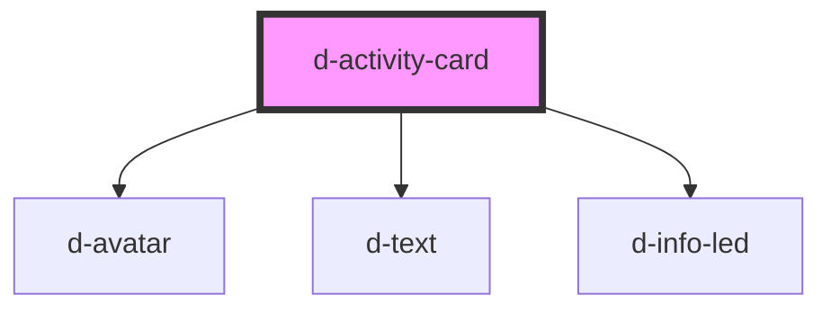

# d-activity-card

<!-- Auto Generated Below -->

## Properties

| Property      | Attribute     | Description | Type                                | Default     |
| ------------- | ------------- | ----------- | ----------------------------------- | ----------- |
| `date`        | `date`        |             | `string`                            | `undefined` |
| `description` | `description` |             | `string`                            | `undefined` |
| `logo`        | `logo`        |             | `string`                            | `undefined` |
| `message`     | `message`     |             | `string`                            | `undefined` |
| `name`        | `name`        |             | `string`                            | `undefined` |
| `read`        | `read`        |             | `boolean`                           | `false`     |
| `type`        | `type`        |             | `"error" \| "success" \| "warning"` | `undefined` |

## Dependencies

### Depends on

- [d-avatar](../avatar)
- [d-text](../text)
- [d-info-led](../info-led)

### Graph

----------------------------------------------

*Built with [StencilJS](https://stenciljs.com/)*
