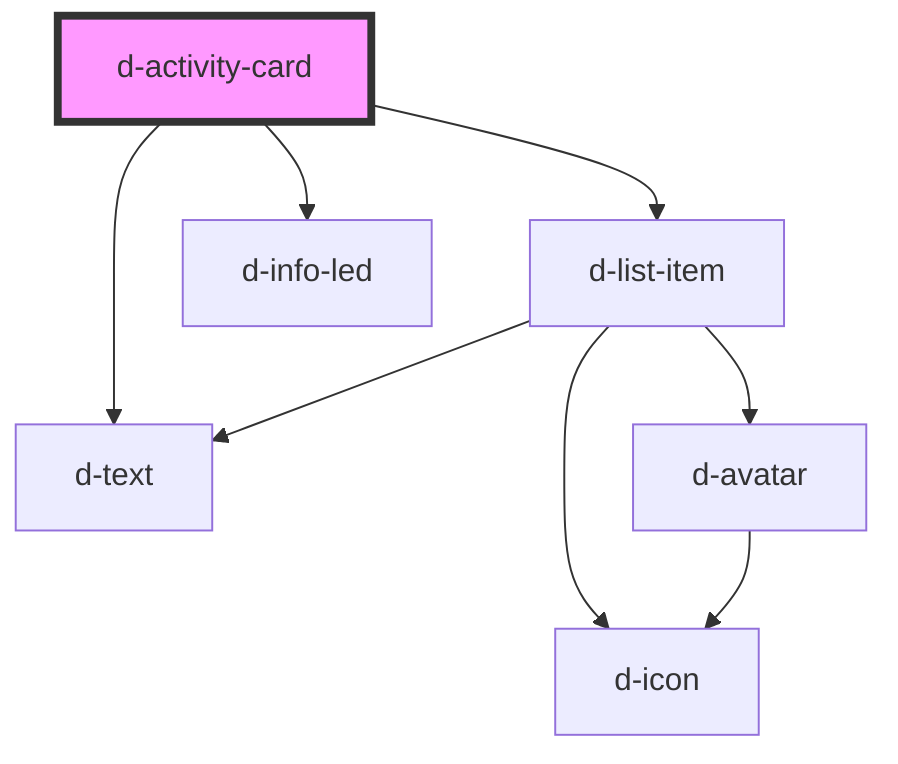

# d-activity-card

<!-- Auto Generated Below -->

## Properties

| Property      | Attribute     | Description | Type      | Default     |
| ------------- | ------------- | ----------- | --------- | ----------- |
| `date`        | `date`        |             | `string`  | `undefined` |
| `description` | `description` |             | `string`  | `undefined` |
| `href`        | `href`        |             | `string`  | `undefined` |
| `logo`        | `logo`        |             | `string`  | `undefined` |
| `message`     | `message`     |             | `string`  | `undefined` |
| `read`        | `read`        |             | `boolean` | `false`     |

## Dependencies

### Depends on

- [d-list-item](../d-list-item)
- [d-info-led](../info-led)
- [d-text](../text)

### Graph

----------------------------------------------

*Built with [StencilJS](https://stenciljs.com/)*
