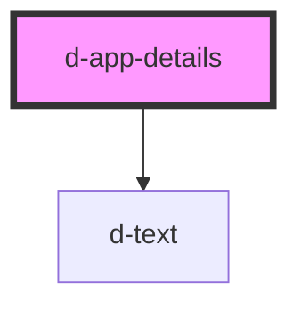

# d-app-details

<!-- Auto Generated Below -->

## Properties

| Property      | Attribute      | Description | Type     | Default                        |
| ------------- | -------------- | ----------- | -------- | ------------------------------ |
| `developedBy` | `developed-by` |             | `string` | `'Develepoded by Forkbomb BV'` |
| `version`     | `version`      |             | `string` | `undefined`                    |

## Dependencies

### Depends on

- [d-text](../text)

### Graph

----------------------------------------------

*Built with [StencilJS](https://stenciljs.com/)*
