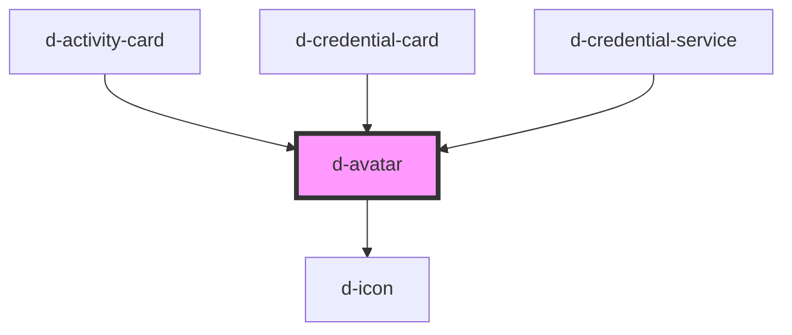

# didroom-avatar

<!-- Auto Generated Below -->

## Properties

| Property | Attribute | Description | Type                                         | Default     |
| -------- | --------- | ----------- | -------------------------------------------- | ----------- |
| `name`   | `name`    |             | `string`                                     | `undefined` |
| `shape`  | `shape`   |             | `string`                                     | `'round'`   |
| `size`   | `size`    |             | `"2xl" \| "l" \| "m" \| "s" \| "xl" \| "xs"` | `'m'`       |
| `src`    | `src`     |             | `string`                                     | `undefined` |

## Dependencies

### Used by

 - [d-activity-card](../activity-card)
 - [d-credential-card](../credential-card)
 - [d-credential-service](../credential-service)

### Depends on

- [d-icon](../icon)

### Graph

----------------------------------------------

*Built with [StencilJS](https://stenciljs.com/)*
