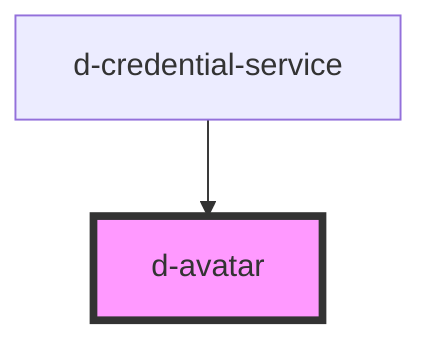

# didroom-avatar

<!-- Auto Generated Below -->

## Properties

| Property | Attribute | Description | Type     | Default     |
| -------- | --------- | ----------- | -------- | ----------- |
| `name`   | `name`    |             | `string` | `undefined` |
| `shape`  | `shape`   |             | `string` | `'round'`   |
| `size`   | `size`    |             | `string` | `'m'`       |
| `src`    | `src`     |             | `string` | `undefined` |

## Dependencies

### Used by

 - [d-credential-service](../credential-service)

### Graph

----------------------------------------------

*Built with [StencilJS](https://stenciljs.com/)*
