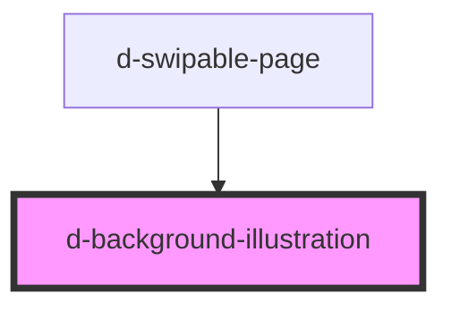

# d-background-illustration

<!-- Auto Generated Below -->

## Properties

| Property     | Attribute    | Description | Type     | Default     |
| ------------ | ------------ | ----------- | -------- | ----------- |
| `background` | `background` |             | `string` | `undefined` |

## Dependencies

### Used by

 - [d-swipable-page](../swipable-page)

### Graph

----------------------------------------------

*Built with [StencilJS](https://stenciljs.com/)*
