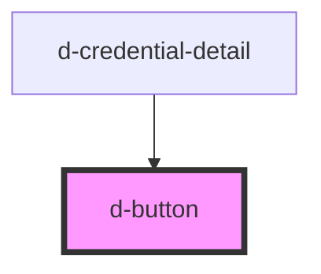

# d-button

<!-- Auto Generated Below -->

## Properties

| Property   | Attribute  | Description | Type      | Default     |
| ---------- | ---------- | ----------- | --------- | ----------- |
| `color`    | `color`    |             | `string`  | `'primary'` |
| `disabled` | `disabled` |             | `boolean` | `false`     |
| `href`     | `href`     |             | `string`  | `undefined` |

## Dependencies

### Used by

 - [d-credential-detail](../credential-detail)

### Graph

----------------------------------------------

*Built with [StencilJS](https://stenciljs.com/)*
