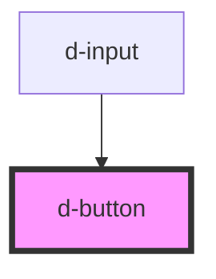

# d-button

<!-- Auto Generated Below -->

## Properties

| Property     | Attribute     | Description | Type                              | Default     |
| ------------ | ------------- | ----------- | --------------------------------- | ----------- |
| `buttonType` | `button-type` |             | `string`                          | `'button'`  |
| `clear`      | `clear`       |             | `boolean`                         | `undefined` |
| `color`      | `color`       |             | `string`                          | `'primary'` |
| `disabled`   | `disabled`    |             | `boolean`                         | `false`     |
| `expand`     | `expand`      |             | `boolean`                         | `undefined` |
| `form`       | `form`        |             | `HTMLFormElement \| string`       | `undefined` |
| `href`       | `href`        |             | `string`                          | `undefined` |
| `size`       | `size`        |             | `"default" \| "large" \| "small"` | `undefined` |
| `type`       | `type`        |             | `"button" \| "reset" \| "submit"` | `'button'`  |

## Events

| Event    | Description | Type                |
| -------- | ----------- | ------------------- |
| `dBlur`  |             | `CustomEvent<void>` |
| `dFocus` |             | `CustomEvent<void>` |

## Dependencies

### Used by

 - [d-input](../input)

### Graph

----------------------------------------------

*Built with [StencilJS](https://stenciljs.com/)*
