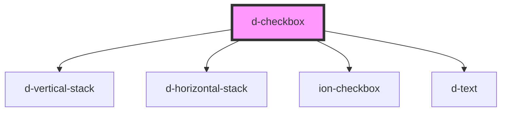

# d-checkbox

<!-- Auto Generated Below -->

## Properties

| Property  | Attribute | Description | Type      | Default     |
| --------- | --------- | ----------- | --------- | ----------- |
| `checked` | `checked` |             | `boolean` | `undefined` |
| `error`   | `error`   |             | `string`  | `undefined` |

## Events

| Event     | Description | Type                   |
| --------- | ----------- | ---------------------- |
| `dChange` |             | `CustomEvent<boolean>` |

## Dependencies

### Depends on

- [d-vertical-stack](../vertical-stack)
- [d-horizontal-stack](../horizontal-stack)
- ion-checkbox
- [d-text](../text)

### Graph

----------------------------------------------

*Built with [StencilJS](https://stenciljs.com/)*
