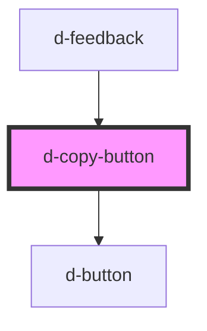

# d-copy-button

<!-- Auto Generated Below -->

## Properties

| Property     | Attribute      | Description | Type     | Default     |
| ------------ | -------------- | ----------- | -------- | ----------- |
| `delay`      | `delay`        |             | `number` | `2000`      |
| `textToCopy` | `text-to-copy` |             | `string` | `undefined` |

## Dependencies

### Used by

 - [d-feedback](../feedback)

### Depends on

- [d-button](../button)

### Graph

----------------------------------------------

*Built with [StencilJS](https://stenciljs.com/)*
