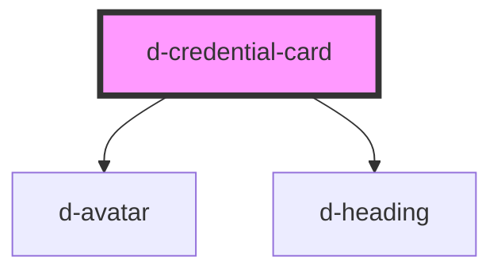

# d-credential-card

<!-- Auto Generated Below -->

## Properties

| Property         | Attribute         | Description | Type      | Default     |
| ---------------- | ----------------- | ----------- | --------- | ----------- |
| `description`    | `description`     |             | `string`  | `undefined` |
| `expirationDate` | `expiration-date` |             | `string`  | `undefined` |
| `issuer`         | `issuer`          |             | `string`  | `undefined` |
| `logoSrc`        | `logo-src`        |             | `string`  | `undefined` |
| `name`           | `name`            |             | `string`  | `undefined` |
| `verified`       | `verified`        |             | `boolean` | `false`     |

## Dependencies

### Depends on

- [d-avatar](../avatar)
- [d-heading](../heading)

### Graph

----------------------------------------------

*Built with [StencilJS](https://stenciljs.com/)*
