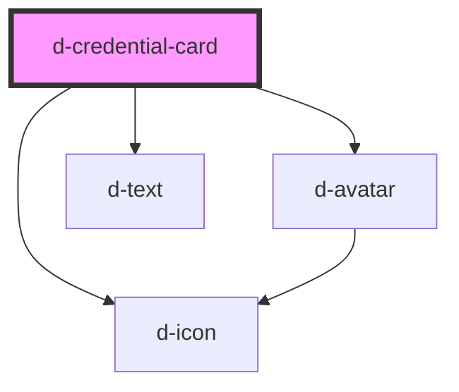

# d-credential-card

<!-- Auto Generated Below -->

## Properties

| Property          | Attribute          | Description | Type      | Default     |
| ----------------- | ------------------ | ----------- | --------- | ----------- |
| `expirationDate`  | `expiration-date`  |             | `string`  | `undefined` |
| `expirationLabel` | `expiration-label` |             | `string`  | `undefined` |
| `issuedByLabel`   | `issued-by-label`  |             | `string`  | `undefined` |
| `issuer`          | `issuer`           |             | `string`  | `undefined` |
| `logoSrc`         | `logo-src`         |             | `string`  | `undefined` |
| `name`            | `name`             |             | `string`  | `undefined` |
| `verified`        | `verified`         |             | `boolean` | `false`     |

## Dependencies

### Depends on

- [d-avatar](../avatar)
- [d-text](../text)
- [d-icon](../icon)

### Graph

----------------------------------------------

*Built with [StencilJS](https://stenciljs.com/)*
