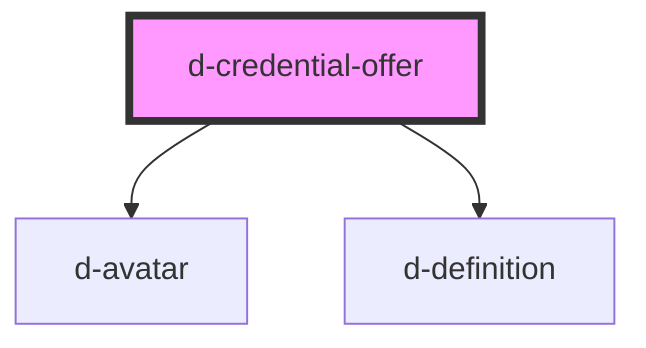

# d-credential-offer

<!-- Auto Generated Below -->

## Properties

| Property          | Attribute          | Description | Type     | Default     |
| ----------------- | ------------------ | ----------- | -------- | ----------- |
| `description`     | `description`      |             | `string` | `undefined` |
| `issuer`          | `issuer`           |             | `string` | `undefined` |
| `logoSrc`         | `logo-src`         |             | `string` | `undefined` |
| `longDescription` | `long-description` |             | `string` | `undefined` |
| `name`            | `name`             |             | `string` | `undefined` |

## Dependencies

### Depends on

- [d-avatar](../avatar)
- [d-definition](../definition)

### Graph

----------------------------------------------

*Built with [StencilJS](https://stenciljs.com/)*
