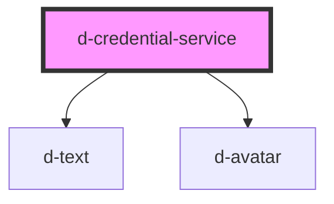

# d-credential-service

<!-- Auto Generated Below -->

## Properties

| Property      | Attribute      | Description | Type     | Default     |
| ------------- | -------------- | ----------- | -------- | ----------- |
| `description` | `description`  |             | `string` | `undefined` |
| `href`        | `href`         |             | `string` | `undefined` |
| `issuer`      | `issuer`       |             | `string` | `undefined` |
| `issuerLabel` | `issuer-label` |             | `string` | `'Issuer'`  |
| `logoSrc`     | `logo-src`     |             | `string` | `undefined` |
| `name`        | `name`         |             | `string` | `undefined` |

## Dependencies

### Depends on

- [d-text](../text)
- [d-avatar](../avatar)

### Graph

----------------------------------------------

*Built with [StencilJS](https://stenciljs.com/)*
