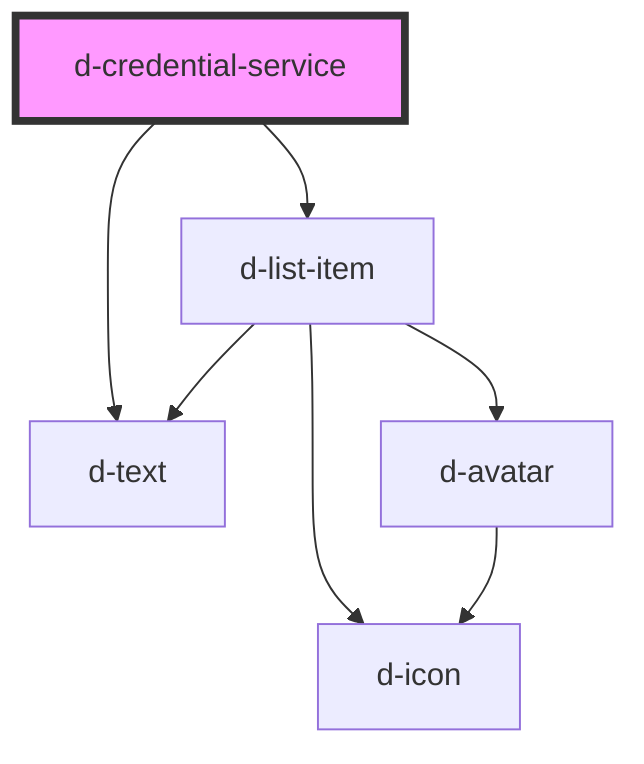

# d-credential-service

<!-- Auto Generated Below -->

## Properties

| Property       | Attribute      | Description | Type     | Default     |
| -------------- | -------------- | ----------- | -------- | ----------- |
| `description`  | `description`  |             | `string` | `undefined` |
| `href`         | `href`         |             | `string` | `undefined` |
| `issuer`       | `issuer`       |             | `string` | `undefined` |
| `logoSrc`      | `logo-src`     |             | `string` | `undefined` |
| `name`         | `name`         |             | `string` | `undefined` |
| `organization` | `organization` |             | `string` | `undefined` |

## Dependencies

### Depends on

- [d-list-item](../d-list-item)
- [d-text](../text)

### Graph

----------------------------------------------

*Built with [StencilJS](https://stenciljs.com/)*
