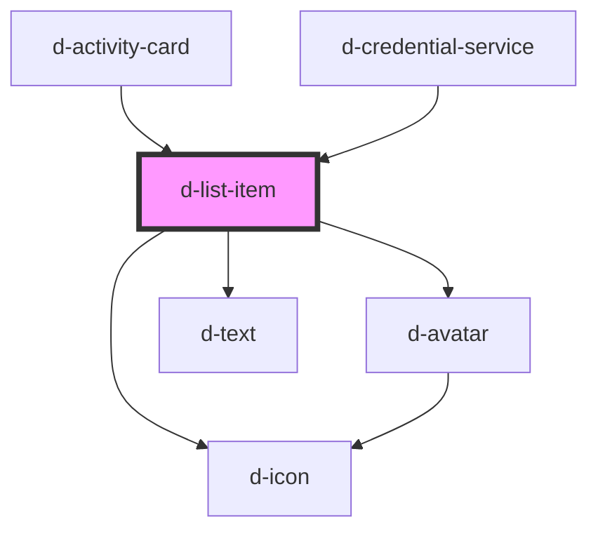

# d-list-item

<!-- Auto Generated Below -->

## Properties

| Property      | Attribute     | Description | Type      | Default     |
| ------------- | ------------- | ----------- | --------- | ----------- |
| `background`  | `background`  |             | `boolean` | `undefined` |
| `description` | `description` |             | `string`  | `undefined` |
| `href`        | `href`        |             | `string`  | `undefined` |
| `issuer`      | `issuer`      |             | `string`  | `undefined` |
| `logoSrc`     | `logo-src`    |             | `string`  | `undefined` |
| `name`        | `name`        |             | `string`  | `undefined` |

## Dependencies

### Used by

 - [d-activity-card](../activity-card)
 - [d-credential-service](../credential-service)

### Depends on

- [d-avatar](../avatar)
- [d-text](../text)
- [d-icon](../icon)

### Graph

----------------------------------------------

*Built with [StencilJS](https://stenciljs.com/)*
