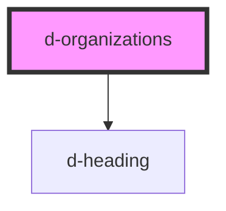

# d-organizations

<!-- Auto Generated Below -->

## Properties

| Property  | Attribute | Description | Type      | Default     |
| --------- | --------- | ----------- | --------- | ----------- |
| `empty`   | `empty`   |             | `boolean` | `false`     |
| `heading` | `heading` |             | `string`  | `undefined` |

## Dependencies

### Depends on

- [d-heading](../heading)

### Graph

----------------------------------------------

*Built with [StencilJS](https://stenciljs.com/)*
