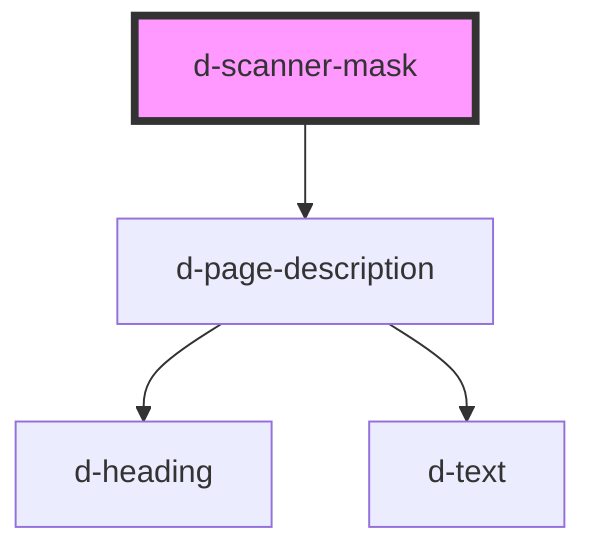

# d-scanner-mask

<!-- Auto Generated Below -->

## Properties

| Property      | Attribute     | Description | Type     | Default     |
| ------------- | ------------- | ----------- | -------- | ----------- |
| `description` | `description` |             | `string` | `undefined` |
| `heading`     | `heading`     |             | `string` | `undefined` |

## Dependencies

### Depends on

- [d-page-description](../page-description)

### Graph

----------------------------------------------

*Built with [StencilJS](https://stenciljs.com/)*
