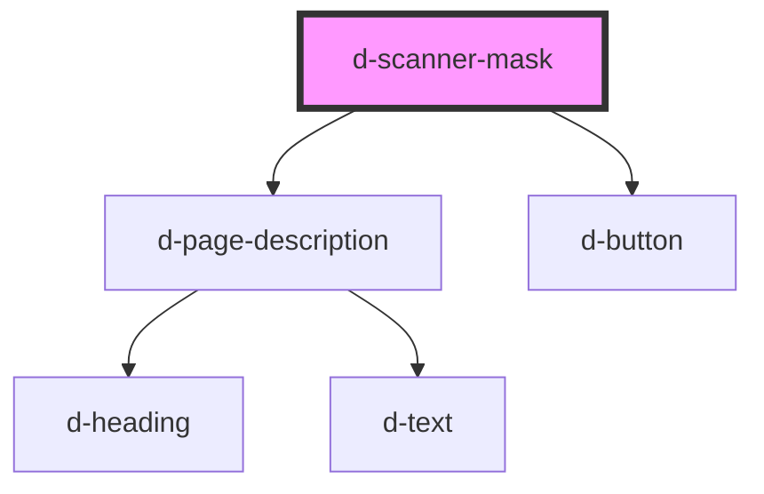

# d-scanner-mask

<!-- Auto Generated Below -->

## Properties

| Property      | Attribute      | Description | Type     | Default     |
| ------------- | -------------- | ----------- | -------- | ----------- |
| `cancelLabel` | `cancel-label` |             | `string` | `'Cancel'`  |
| `description` | `description`  |             | `string` | `undefined` |
| `heading`     | `heading`      |             | `string` | `undefined` |

## Events

| Event         | Description | Type                |
| ------------- | ----------- | ------------------- |
| `cancelClick` |             | `CustomEvent<void>` |

## Dependencies

### Depends on

- [d-page-description](../page-description)
- [d-button](../button)

### Graph

----------------------------------------------

*Built with [StencilJS](https://stenciljs.com/)*
