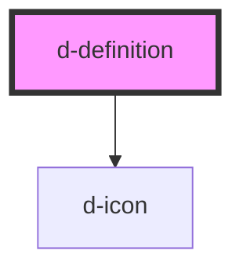

# d-definition

<!-- Auto Generated Below -->

## Properties

| Property     | Attribute    | Description | Type      | Default     |
| ------------ | ------------ | ----------- | --------- | ----------- |
| `definition` | `definition` |             | `string`  | `undefined` |
| `hidable`    | `hidable`    |             | `boolean` | `undefined` |
| `title`      | `title`      |             | `string`  | `undefined` |

## Dependencies

### Depends on

- [d-icon](../icon)

### Graph

----------------------------------------------

*Built with [StencilJS](https://stenciljs.com/)*
