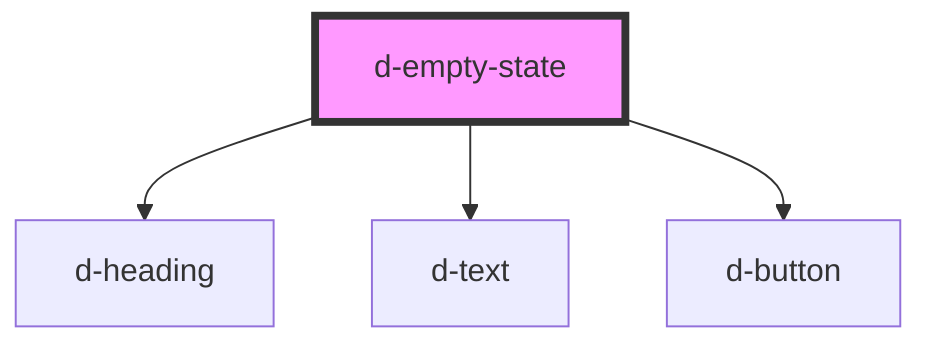

# d-empty-state

<!-- Auto Generated Below -->

## Properties

| Property     | Attribute     | Description | Type     | Default     |
| ------------ | ------------- | ----------- | -------- | ----------- |
| `buttonText` | `button-text` |             | `string` | `undefined` |
| `heading`    | `heading`     |             | `string` | `undefined` |
| `href`       | `href`        |             | `string` | `undefined` |
| `text`       | `text`        |             | `string` | `undefined` |

## Dependencies

### Depends on

- [d-heading](../heading)
- [d-text](../text)
- [d-button](../button)

### Graph

----------------------------------------------

*Built with [StencilJS](https://stenciljs.com/)*
