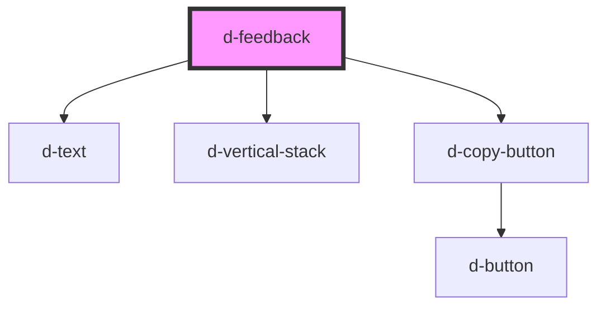

# d-toast

<!-- Auto Generated Below -->

## Properties

| Property   | Attribute  | Description | Type                   | Default     |
| ---------- | ---------- | ----------- | ---------------------- | ----------- |
| `feedback` | `feedback` |             | `string`               | `''`        |
| `message`  | `message`  |             | `string`               | `undefined` |
| `type`     | `type`     |             | `"error" \| "success"` | `'success'` |

## Events

| Event    | Description | Type                |
| -------- | ----------- | ------------------- |
| `dClose` |             | `CustomEvent<void>` |

## Dependencies

### Depends on

- [d-text](../text)
- [d-vertical-stack](../vertical-stack)
- [d-copy-button](../copy-button)

### Graph

----------------------------------------------

*Built with [StencilJS](https://stenciljs.com/)*
