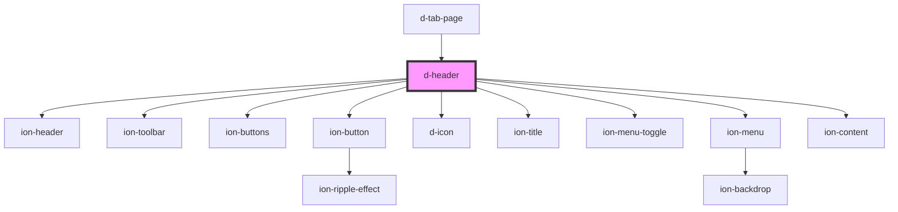

# d-header

<!-- Auto Generated Below -->

## Properties

| Property        | Attribute        | Description | Type      | Default      |
| --------------- | ---------------- | ----------- | --------- | ------------ |
| `backButton`    | `back-button`    |             | `boolean` | `false`      |
| `settings`      | `settings`       |             | `boolean` | `false`      |
| `settingsTitle` | `settings-title` |             | `string`  | `'Settings'` |

## Events

| Event             | Description | Type                |
| ----------------- | ----------- | ------------------- |
| `backButtonClick` |             | `CustomEvent<void>` |

## Dependencies

### Used by

 - [d-tab-page](../tab-page)

### Depends on

- ion-header
- ion-toolbar
- ion-buttons
- ion-button
- [d-icon](../icon)
- ion-title
- ion-menu-toggle
- ion-menu
- ion-content

### Graph

----------------------------------------------

*Built with [StencilJS](https://stenciljs.com/)*
