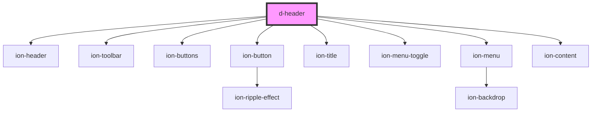

# d-header

<!-- Auto Generated Below -->

## Properties

| Property       | Attribute     | Description | Type         | Default               |
| -------------- | ------------- | ----------- | ------------ | --------------------- |
| `backButton`   | `back-button` |             | `boolean`    | `false`               |
| `backFunction` | --            |             | `() => void` | `window.history.back` |
| `settings`     | `settings`    |             | `boolean`    | `false`               |

## Dependencies

### Depends on

- ion-header
- ion-toolbar
- ion-buttons
- ion-button
- ion-title
- ion-menu-toggle
- ion-menu
- ion-content

### Graph

----------------------------------------------

*Built with [StencilJS](https://stenciljs.com/)*
