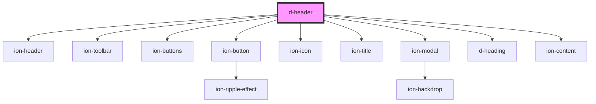

# d-header

<!-- Auto Generated Below -->

## Properties

| Property     | Attribute     | Description | Type      | Default |
| ------------ | ------------- | ----------- | --------- | ------- |
| `backButton` | `back-button` |             | `boolean` | `false` |
| `settings`   | `settings`    |             | `boolean` | `false` |

## Dependencies

### Depends on

- ion-header
- ion-toolbar
- ion-buttons
- ion-button
- ion-icon
- ion-title
- ion-modal
- [d-heading](../heading)
- ion-content

### Graph

----------------------------------------------

*Built with [StencilJS](https://stenciljs.com/)*
