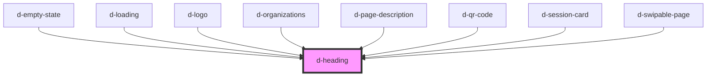

# d-heading

<!-- Auto Generated Below -->

## Properties

| Property | Attribute | Description | Type                                                         | Default     |
| -------- | --------- | ----------- | ------------------------------------------------------------ | ----------- |
| `color`  | `color`   |             | `"accent" \| "error" \| "primary" \| "success" \| "warning"` | `'primary'` |
| `size`   | `size`    |             | `"2xl" \| "l" \| "m" \| "s" \| "xl" \| "xs"`                 | `'m'`       |

## Dependencies

### Used by

 - [d-empty-state](../empty-state)
 - [d-loading](../loading)
 - [d-logo](../logo)
 - [d-organizations](../organizations)
 - [d-page-description](../page-description)
 - [d-qr-code](../qr-code)
 - [d-session-card](../session-card)
 - [d-swipable-page](../swipable-page)

### Graph

----------------------------------------------

*Built with [StencilJS](https://stenciljs.com/)*
