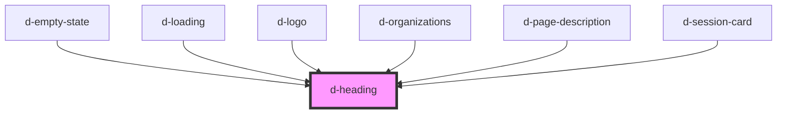

# d-heading

<!-- Auto Generated Below -->

## Properties

| Property | Attribute | Description | Type     | Default     |
| -------- | --------- | ----------- | -------- | ----------- |
| `color`  | `color`   |             | `string` | `'primary'` |
| `size`   | `size`    |             | `string` | `'m'`       |

## Dependencies

### Used by

 - [d-empty-state](../empty-state)
 - [d-loading](../d-loading)
 - [d-logo](../logo)
 - [d-organizations](../d-organizations)
 - [d-page-description](../page-description)
 - [d-session-card](../session-card)

### Graph

----------------------------------------------

*Built with [StencilJS](https://stenciljs.com/)*
