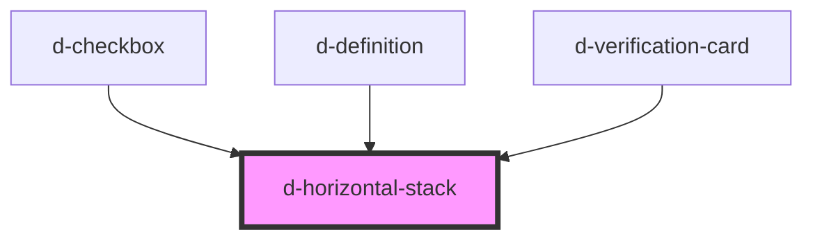

# d-vertical-stack

<!-- Auto Generated Below -->

## Properties

| Property | Attribute | Description | Type               | Default |
| -------- | --------- | ----------- | ------------------ | ------- |
| `gap`    | `gap`     |             | `0 \| 2 \| 4 \| 8` | `2`     |

## Dependencies

### Used by

 - [d-checkbox](../checkbox)
 - [d-definition](../definition)
 - [d-verification-card](../verification-card)

### Graph

----------------------------------------------

*Built with [StencilJS](https://stenciljs.com/)*
