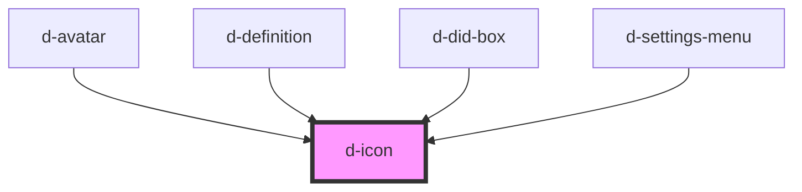

# library-name-icon

<!-- Auto Generated Below -->

## Properties

| Property  | Attribute | Description | Type      | Default |
| --------- | --------- | ----------- | --------- | ------- |
| `icon`    | `icon`    |             | `string`  | `null`  |
| `outline` | `outline` |             | `boolean` | `false` |
| `size`    | `size`    |             | `number`  | `24`    |

## Dependencies

### Used by

 - [d-avatar](../avatar)
 - [d-definition](../definition)
 - [d-did-box](../d-did-box)
 - [d-settings-menu](../d-settings-menu)

### Graph

----------------------------------------------

*Built with [StencilJS](https://stenciljs.com/)*
