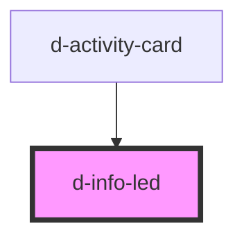

# d-info-led

<!-- Auto Generated Below -->

## Properties

| Property | Attribute | Description | Type                                | Default     |
| -------- | --------- | ----------- | ----------------------------------- | ----------- |
| `type`   | `type`    |             | `"error" \| "success" \| "warning"` | `'success'` |

## Dependencies

### Used by

 - [d-activity-card](../activity-card)

### Graph

----------------------------------------------

*Built with [StencilJS](https://stenciljs.com/)*
