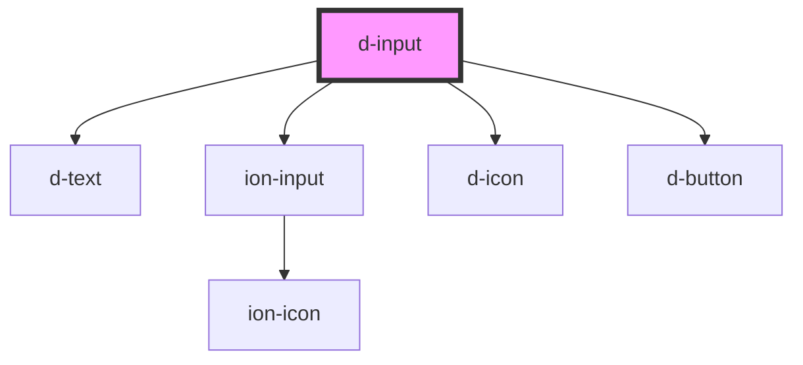

# d-input

<!-- Auto Generated Below -->

## Properties

| Property      | Attribute      | Description | Type                                          | Default     |
| ------------- | -------------- | ----------- | --------------------------------------------- | ----------- |
| `autoFocus`   | `auto-focus`   |             | `boolean`                                     | `undefined` |
| `clearButton` | `clear-button` |             | `boolean`                                     | `undefined` |
| `errorText`   | `error-text`   |             | `string`                                      | `undefined` |
| `helperText`  | `helper-text`  |             | `string`                                      | `undefined` |
| `hidable`     | `hidable`      |             | `boolean`                                     | `undefined` |
| `label`       | `label`        |             | `string`                                      | `undefined` |
| `name`        | `name`         |             | `string`                                      | `undefined` |
| `personIcon`  | `person-icon`  |             | `boolean`                                     | `undefined` |
| `placeholder` | `placeholder`  |             | `string`                                      | `undefined` |
| `type`        | `type`         |             | `"email" \| "number" \| "password" \| "text"` | `'text'`    |
| `value`       | `value`        |             | `string`                                      | `undefined` |

## Events

| Event     | Description | Type                  |
| --------- | ----------- | --------------------- |
| `dChange` |             | `CustomEvent<string>` |
| `dInput`  |             | `CustomEvent<string>` |

## Dependencies

### Depends on

- [d-text](../text)
- ion-input
- [d-icon](../icon)
- [d-button](../button)

### Graph

----------------------------------------------

*Built with [StencilJS](https://stenciljs.com/)*
