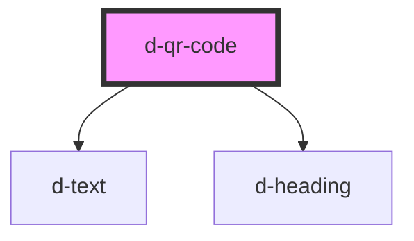

# d-qr-code

<!-- Auto Generated Below -->

## Properties

| Property         | Attribute          | Description | Type     | Default         |
| ---------------- | ------------------ | ----------- | -------- | --------------- |
| `generationDate` | `generation-date`  |             | `string` | `undefined`     |
| `generationHour` | `generation-hour`  |             | `string` | `undefined`     |
| `qr`             | `qr`               |             | `string` | `undefined`     |
| `relyingParty`   | `relying-party`    |             | `string` | `undefined`     |
| `sessionId`      | `session-id`       |             | `string` | `undefined`     |
| `sessionIdLabel` | `session-id-label` |             | `string` | `'Session ID:'` |
| `verifierLabel`  | `verifier-label`   |             | `string` | `'Verifier'`    |

## Dependencies

### Depends on

- [d-text](../text)
- [d-heading](../heading)

### Graph

----------------------------------------------

*Built with [StencilJS](https://stenciljs.com/)*
