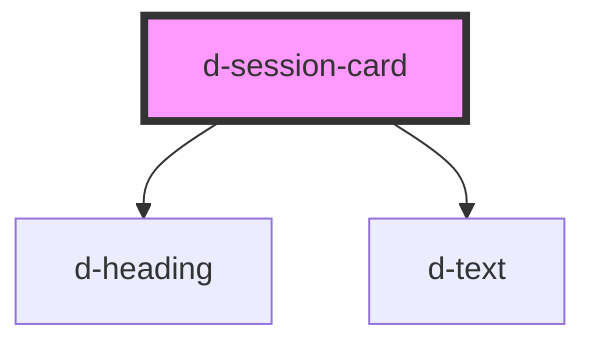

# d-session-card

<!-- Auto Generated Below -->

## Properties

| Property  | Attribute | Description | Type      | Default     |
| --------- | --------- | ----------- | --------- | ----------- |
| `date`    | `date`    |             | `string`  | `''`        |
| `sid`     | `sid`     |             | `string`  | `undefined` |
| `success` | `success` |             | `boolean` | `false`     |

## Dependencies

### Depends on

- [d-heading](../heading)
- [d-text](../text)

### Graph

----------------------------------------------

*Built with [StencilJS](https://stenciljs.com/)*
