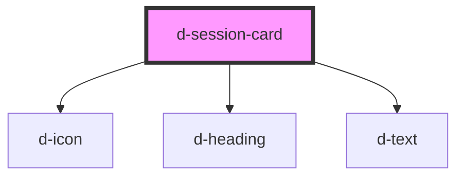

# d-session-card

<!-- Auto Generated Below -->

## Properties

| Property            | Attribute             | Description | Type      | Default            |
| ------------------- | --------------------- | ----------- | --------- | ------------------ |
| `date`              | `date`                |             | `string`  | `''`               |
| `failureMessage`    | `failure-message`     |             | `string`  | `'Failure.'`       |
| `inProgress`        | `in-progress`         |             | `boolean` | `false`            |
| `inProgressMessage` | `in-progress-message` |             | `string`  | `'In progress...'` |
| `sessionMessage`    | `session-message`     |             | `string`  | `'Session id:'`    |
| `sid`               | `sid`                 |             | `string`  | `undefined`        |
| `success`           | `success`             |             | `boolean` | `false`            |
| `verifiedMessage`   | `verified-message`    |             | `string`  | `'Verified.'`      |

## Dependencies

### Depends on

- [d-icon](../icon)
- [d-heading](../heading)
- [d-text](../text)

### Graph

----------------------------------------------

*Built with [StencilJS](https://stenciljs.com/)*
