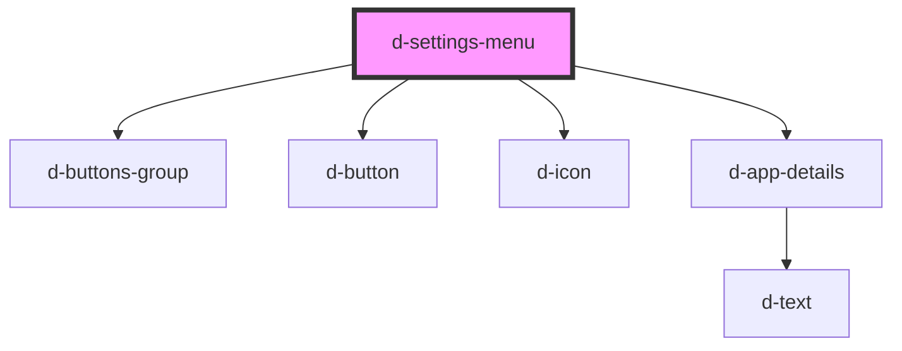

# d-settings-menu

<!-- Auto Generated Below -->

## Properties

| Property                | Attribute                | Description | Type     | Default     |
| ----------------------- | ------------------------ | ----------- | -------- | ----------- |
| `accountSettings`       | `account-settings`       |             | `string` | `undefined` |
| `developedBy`           | `developed-by`           |             | `string` | `undefined` |
| `languages`             | `languages`              |             | `string` | `undefined` |
| `logOut`                | `log-out`                |             | `string` | `undefined` |
| `notificationsSettings` | `notifications-settings` |             | `string` | `undefined` |
| `privacyPolicy`         | `privacy-policy`         |             | `string` | `undefined` |
| `support`               | `support`                |             | `string` | `undefined` |
| `version`               | `version`                |             | `string` | `undefined` |

## Events

| Event                   | Description | Type                |
| ----------------------- | ----------- | ------------------- |
| `accountSettingsClick`  |             | `CustomEvent<void>` |
| `appSettingsClick`      |             | `CustomEvent<void>` |
| `languageSettingsClick` |             | `CustomEvent<void>` |
| `logoutClick`           |             | `CustomEvent<void>` |

## Dependencies

### Depends on

- [d-buttons-group](../buttons-group)
- [d-button](../button)
- [d-icon](../icon)
- [d-app-details](../app-details)

### Graph

----------------------------------------------

*Built with [StencilJS](https://stenciljs.com/)*
