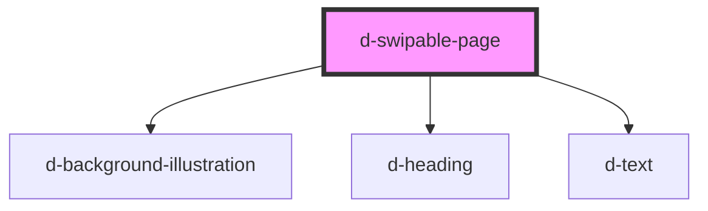

# d-swipable-page

<!-- Auto Generated Below -->

## Properties

| Property      | Attribute     | Description | Type     | Default     |
| ------------- | ------------- | ----------- | -------- | ----------- |
| `background`  | `background`  |             | `string` | `undefined` |
| `description` | `description` |             | `string` | `undefined` |
| `subtitle`    | `subtitle`    |             | `string` | `undefined` |
| `title`       | `title`       |             | `string` | `undefined` |

## Dependencies

### Depends on

- [d-background-illustration](../background-illustration)
- [d-heading](../heading)
- [d-text](../text)

### Graph

----------------------------------------------

*Built with [StencilJS](https://stenciljs.com/)*
