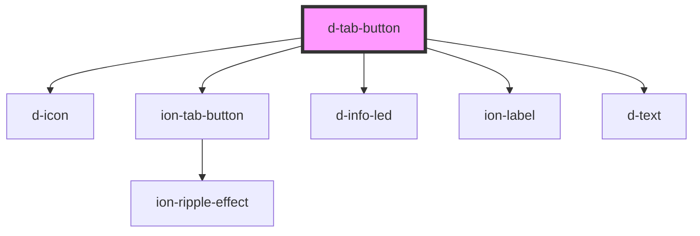

# d-tab-button

<!-- Auto Generated Below -->

## Properties

| Property   | Attribute   | Description | Type                                            | Default     |
| ---------- | ----------- | ----------- | ----------------------------------------------- | ----------- |
| `active`   | `active`    |             | `boolean`                                       | `false`     |
| `hasAlert` | `has-alert` |             | `boolean`                                       | `false`     |
| `tab`      | `tab`       |             | `"activity" \| "home" \| "profile" \| "wallet"` | `undefined` |

## Dependencies

### Depends on

- [d-icon](../icon)
- ion-tab-button
- [d-info-led](../info-led)
- ion-label
- [d-text](../text)

### Graph

----------------------------------------------

*Built with [StencilJS](https://stenciljs.com/)*
