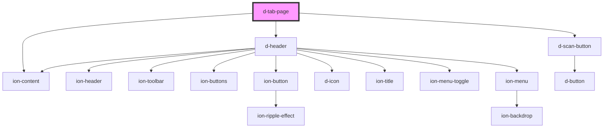

# d-tab-page

<!-- Auto Generated Below -->

## Properties

| Property         | Attribute          | Description | Type      | Default     |
| ---------------- | ------------------ | ----------- | --------- | ----------- |
| `scanButtonHref` | `scan-button-href` |             | `string`  | `undefined` |
| `scanButtonText` | `scan-button-text` |             | `string`  | `undefined` |
| `settings`       | `settings`         |             | `boolean` | `false`     |
| `tab`            | `tab`              |             | `string`  | `undefined` |
| `title`          | `title`            |             | `string`  | `undefined` |

## Dependencies

### Depends on

- [d-header](../header)
- ion-content
- [d-scan-button](../scan-button)

### Graph

----------------------------------------------

*Built with [StencilJS](https://stenciljs.com/)*
