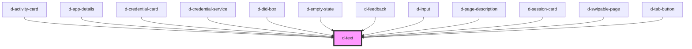

# d-text

<!-- Auto Generated Below -->

## Properties

| Property | Attribute | Description | Type     | Default     |
| -------- | --------- | ----------- | -------- | ----------- |
| `color`  | `color`   |             | `string` | `'primary'` |
| `size`   | `size`    |             | `string` | `'m'`       |

## Dependencies

### Used by

 - [d-activity-card](../activity-card)
 - [d-app-details](../app-details)
 - [d-credential-card](../credential-card)
 - [d-credential-service](../credential-service)
 - [d-did-box](../d-did-box)
 - [d-empty-state](../empty-state)
 - [d-feedback](../feedback)
 - [d-input](../input)
 - [d-page-description](../page-description)
 - [d-session-card](../session-card)
 - [d-swipable-page](../swipable-page)
 - [d-tab-button](../tab-button)

### Graph

----------------------------------------------

*Built with [StencilJS](https://stenciljs.com/)*
