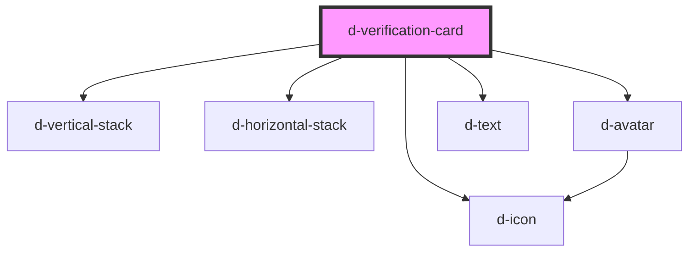

# d-verification-card

<!-- Auto Generated Below -->

## Properties

| Property       | Attribute       | Description | Type      | Default     |
| -------------- | --------------- | ----------- | --------- | ----------- |
| `flow`         | `flow`          |             | `string`  | `undefined` |
| `logo`         | `logo`          |             | `string`  | `undefined` |
| `relyingParty` | `relying-party` |             | `string`  | `undefined` |
| `selected`     | `selected`      |             | `boolean` | `false`     |
| `verifier`     | `verifier`      |             | `string`  | `undefined` |

## Dependencies

### Depends on

- [d-vertical-stack](../vertical-stack)
- [d-horizontal-stack](../horizontal-stack)
- [d-avatar](../avatar)
- [d-icon](../icon)
- [d-text](../text)

### Graph

----------------------------------------------

*Built with [StencilJS](https://stenciljs.com/)*
