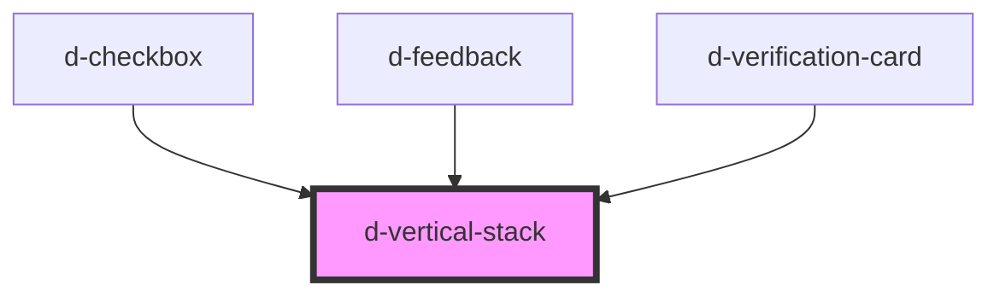

# d-vertical-stack

<!-- Auto Generated Below -->

## Properties

| Property    | Attribute   | Description | Type               | Default |
| ----------- | ----------- | ----------- | ------------------ | ------- |
| `gap`       | `gap`       |             | `0 \| 2 \| 4 \| 8` | `2`     |
| `separator` | `separator` |             | `boolean`          | `false` |

## Dependencies

### Used by

 - [d-checkbox](../checkbox)
 - [d-feedback](../feedback)
 - [d-verification-card](../verification-card)

### Graph

----------------------------------------------

*Built with [StencilJS](https://stenciljs.com/)*
